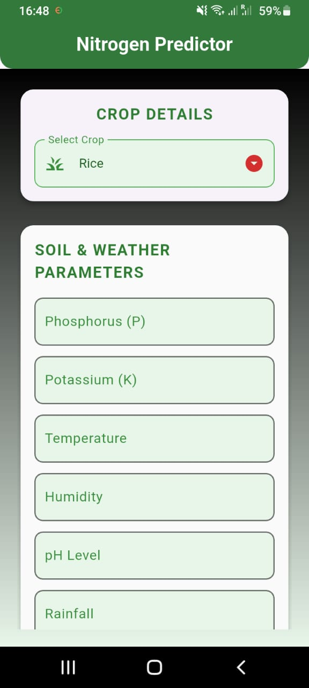
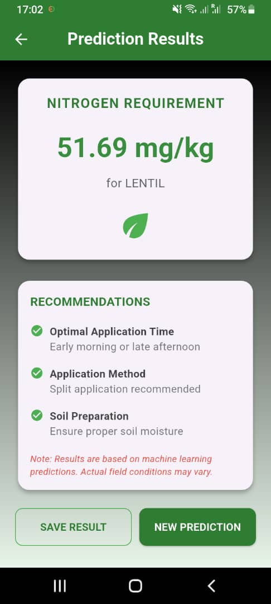

## My Mission is to empower farmers in Africa by intergrating technology and AI through developing an application that will help farmers quickily identify plant diseases, enabling them to take timely action to reduce yield losses and significantly boost their harvests. 

## Source of The Dataset:

[Data source](https://www.kaggle.com/datasets/atharvaingle/crop-recommendation-dataset?select=Crop_recommendation.csv)

**For this project, I have developed an agricultural application that leverages a Random Forest regression model to optimize crop nutrition. The system analyzes key environmental and soil parameters—including temperature, humidity, pH levels, rainfall, potassium, and phosphorus—to provide precise nitrogen recommendations for specific crops.**


## Images of the App



## Try the Model Online (Hosted on Render)

🔗 [Access the API here](https://linear-regression-model-irc0.onrender.com/docs )

> **Note:** The app is hosted on a free tier via Render, so it may take 30–60 seconds to load upon first visit (the server wakes up from sleep).

###  How to Use:
1. Visit the Swagger UI documentation:  
   [Access the API here](https://linear-regression-model-irc0.onrender.com/docs )
2. Click on the **`/predict`** endpoint.
3. Input values for your environmental and soil data, and select a crop.
4. Click **"Try it out"** to get the recommended nitrogen level.

To see the list of supported crops, use the **`/crop-types`** endpoint.

## Run the Backend Locally

### Prerequisites:
- Python 3.13.9
- `pip` package manager

### Steps:
1. Clone the repository:
   ```bash
   git clone https://github.com/mangaorphy/linear_regression_model.git 
   cd linear_regression_model

2. Create a virtual environment (recommended):
- python -m venv venv
- source venv/bin/activate  # On Windows: venv\Scripts\activate

3. Install dependencies:
- pip install -r requirements.txt

4. pip install -r requirements.txt
- uvicorn API.prediction:app --host 0.0.0.0 --port 10000

5. Open the interactive docs at:
http://localhost:10000/docs

## Run The Flutter Frontend Application

**Prerequisites:**
- Flutter SDK installed
- Android Studio / Xcode / or emulator configured
- Device or emulator running

## Steps:
1. Navigate into the summative folder:
cd summativelinear_regression_app/

2. Get flutter packages:
 flutter pub get

3. Run the app:
flutter run

## Using the App:
Enter the required input values (temperature, humidity, pH, rainfall, potassium, phosphorus).
Select a crop from the dropdown menu.
Press the "Predict Nitrogen" button to receive a tailored nitrogen recommendation.